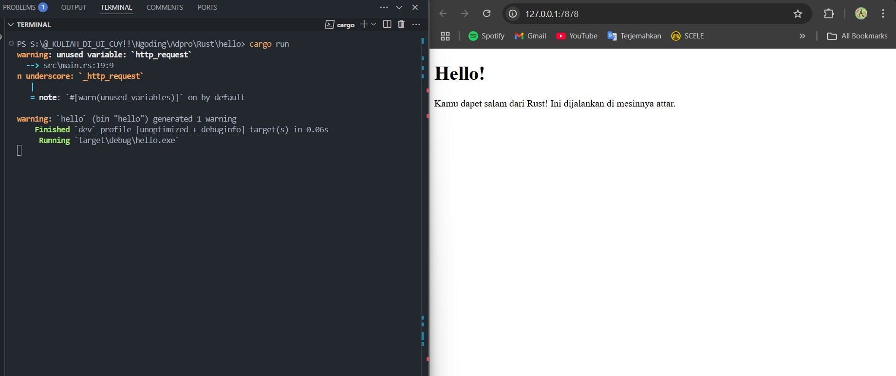
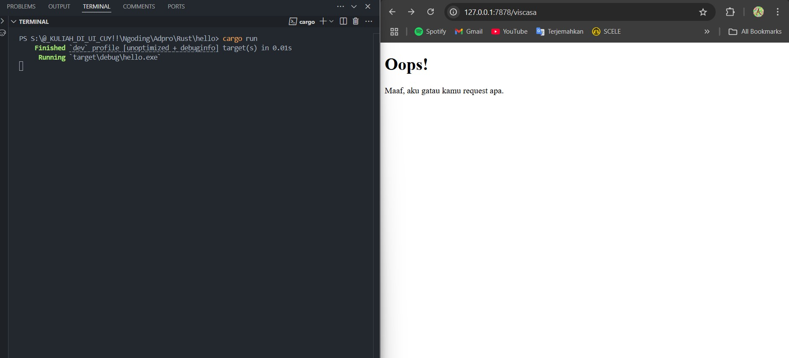
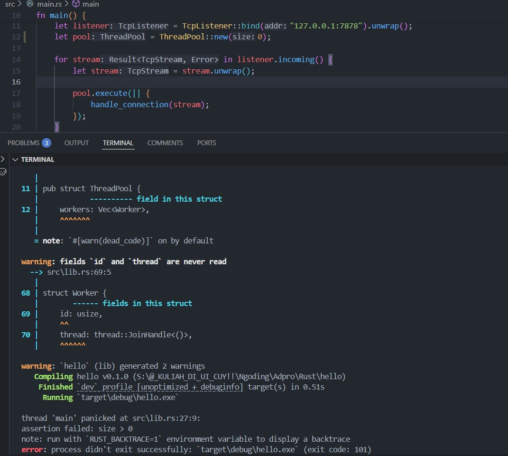

<div align="center">
    <h1>MODULE 6</h1>
</div>

<div align="center">
    
</div>

<div align="center">
    <h2>Alwie Attar Elfandra</h2>
    <h2>2306241726</h2>
</div>

## Commit 1

Fungsi `handle_connection` menerima parameter `stream` bertipe `TcpStream`, yang merepresentasikan koneksi jaringan dengan klien. Berikut adalah penjelasan langkah demi langkah dari fungsi tersebut:  

### **1. Membungkus `TcpStream` dalam `BufReader`**
```rust
let buf_reader = BufReader::new(&mut stream);
```
- `BufReader` digunakan untuk membaca data dari `stream` secara buffered, yang meningkatkan efisiensi I/O dibandingkan membaca byte per byte langsung dari `TcpStream`.  

### **2. Membaca Baris demi Baris Permintaan HTTP**
```rust
let http_request: Vec<_> = buf_reader
    .lines()
    .map(|result| result.unwrap())
    .take_while(|line| !line.is_empty())
    .collect();
```
- `.lines()`: Menghasilkan iterator yang membaca koneksi sebagai baris-baris teks.  
- `.map(|result| result.unwrap())`: Mengambil setiap hasil dari iterator, yang bertipe `Result<String, Error>`, dan menggunakan `.unwrap()` untuk mendapatkan nilai `String`. (Perlu diperhatikan bahwa `.unwrap()` dapat menyebabkan panic jika terjadi error.)  
- `.take_while(|line| !line.is_empty())`: Mengambil baris-baris selama baris tersebut tidak kosong. Dalam protokol HTTP, bagian header dan request dipisahkan oleh baris kosong, jadi ini memastikan hanya header request yang dikumpulkan.  
- `.collect()`: Mengubah iterator menjadi `Vec<String>` untuk menyimpan semua baris request dalam sebuah vektor.  

### **3. Mencetak Request ke Konsol**
```rust
println!("Request: {:#?}", http_request);
```
- Menampilkan daftar baris permintaan HTTP yang diterima dari klien dengan format yang lebih mudah dibaca (`{:#?}` adalah pretty-print untuk debugging).  

TLDR : Fungsi `handle_connection` membaca permintaan HTTP dari klien, mengambil header request hingga menemukan baris kosong, lalu mencetaknya ke konsol.

Adapun pada device saya, request yang diterima kurang lebih :
1. Jenis Permintaan: GET / HTTP/1.1 (permintaan halaman utama)
2. User-Agent: Browser yang digunakan adalah Chrome versi 134 di Windows.
3. Cookie: Terdapat informasi sesi pengguna dengan user_role=Pelanggan dan user_name=Andi, yang menunjukkan bahwa klien sudah login. (Ini merupakan cookies dari matkul Basdat)
4. Keamanan: Header seperti Sec-Fetch-Site, Sec-Fetch-Mode, dan Sec-Fetch-User membantu mencegah serangan keamanan seperti CSRF.

## Commit 2

<div align="center">
    
</div>

Pada versi terbaru dari fungsi `handle_connection`, ada beberapa perubahan penting dibandingkan versi sebelumnya:  

### **1. Menambahkan Respons HTTP**  
Sebelumnya, fungsi hanya membaca dan mencetak permintaan HTTP ke konsol. Sekarang, ia juga mengirimkan respons HTTP ke klien.  

```rust
let status_line = "HTTP/1.1 200 OK"; 
```
- Menentukan status respons HTTP. Di sini, kita mengembalikan kode status **200 OK**, yang berarti permintaan berhasil.  

### **2. Membaca Konten dari File (`hello.html`)**  

```rust
let contents = fs::read_to_string("hello.html").unwrap(); 
let length = contents.len();
```
- `fs::read_to_string("hello.html")` membaca isi file `hello.html` sebagai string.  
- `contents.len()` menghitung panjang konten untuk dikirimkan dalam respons HTTP.  

### **3. Menyusun Respons HTTP Lengkap**  
```rust
let response = format!("{status_line}\r\nContent-Length: {length}\r\n\r\n{contents}");
```
- `format!` digunakan untuk menyusun respons HTTP.  
- `\r\n` digunakan untuk memisahkan header dan body dalam format HTTP.  

### **4. Menulis Respons ke `stream`**  
```rust
stream.write_all(response.as_bytes()).unwrap();
```
- `write_all()` mengirimkan respons HTTP ke klien dalam bentuk byte.  
- `unwrap()` digunakan untuk menangani kemungkinan error saat menulis ke stream.  

TLDR :

Perbedaan utama dari versi sebelumnya adalah:  
1. **Menambahkan Respons HTTP** → Sekarang fungsi tidak hanya membaca request tetapi juga mengirimkan respons.  
2. **Membaca File HTML** → Menggunakan `fs::read_to_string` untuk membaca file dan menggunakannya sebagai body respons.  
3. **Menyusun dan Mengirimkan Respons HTTP** → Membentuk format HTTP yang valid dan mengirimkan respons ke klien.  

## Commit 3

<div align="center">
    
</div>


### **Pemisahan Respons HTTP**  
Pemisahan respons HTTP dilakukan dengan mengecek request yang dilakukan oleh pengguna :
  - Jika request adalah `GET / HTTP/1.1`, berarti pengguna mengakses halaman utama → Kirim **status 200 OK** dan file `hello.html`.  
  - Jika request berbeda → Kirim **status 404 NOT FOUND** dan file `404.html`.  

### **Mengapa Refactoring Diperlukan?**  
Pada versi sebelumnya, ada banyak duplikasi dalam `if` dan `else`. Kedua blok kode melakukan:  
1. **Membaca file**  
2. **Menghitung panjang konten**  
3. **Menyusun dan mengirimkan respons**  

Satu-satunya perbedaan adalah nilai **status line** dan **nama file**. Dengan refactoring, kita memisahkan bagian yang berbeda ke dalam variabel (`status_line` dan `filename`) dan menggunakan variabel ini dalam kode selanjutnya.  

Kode sebelum refactoring (kurang efisien):  
```rust
if request_line == "GET / HTTP/1.1" {
    let status_line = "HTTP/1.1 200 OK";
    let filename = "hello.html";
    let contents = fs::read_to_string(filename).unwrap(); 
    let length = contents.len();
    let response = format!("{status_line}\r\nContent-Length: {length}\r\n\r\n{contents}");
    stream.write_all(response.as_bytes()).unwrap();
} else {
    let status_line = "HTTP/1.1 404 NOT FOUND";
    let filename = "404.html";
    let contents = fs::read_to_string(filename).unwrap(); 
    let length = contents.len();
    let response = format!("{status_line}\r\nContent-Length: {length}\r\n\r\n{contents}");
    stream.write_all(response.as_bytes()).unwrap();
}
```
  
Kode setelah refactoring (lebih ringkas dan lebih mudah dipahami):  
```rust
let (status_line, filename) = if request_line == "GET / HTTP/1.1" {
    ("HTTP/1.1 200 OK", "hello.html")
} else {
    ("HTTP/1.1 404 NOT FOUND", "404.html")
};
let contents = fs::read_to_string(filename).unwrap(); 
let length = contents.len();
let response = format!("{status_line}\r\nContent-Length: {length}\r\n\r\n{contents}");
stream.write_all(response.as_bytes()).unwrap();
```
  
TLDR : 
1.  Sekarang response yang diberikan bergantung pada request yang diminta oleh pengguna. if halaman utama → hello.html, else → 404.html.
2. **Mengurangi duplikasi kode** → Tidak perlu menulis ulang proses membaca file dan menyusun respons di setiap cabang `if-else`.  
3. **Memisahkan elemen yang berbeda** → Status line dan nama file ditentukan terlebih dahulu sebelum membaca file.  

## Commit 4

Pada perubahan ini, saya menambahkan rute `GET /sleep HTTP/1.1`, yang menyebabkan server **menunggu 10 detik** sebelum mengirimkan respons.  

#### **Membuka Dua Tab Browser**  
1. **Tab 1:** Akses `127.0.0.1/sleep` → Server menunda respons selama **10 detik**.  
2. **Tab 2:** Akses `127.0.0.1/` → Web juga mengalami **penundaan** meskipun tidak meminta `/sleep`.  

#### **Mengapa Ini Terjadi?**  
- Server saat ini berjalan secara **sinkron**, artinya setiap permintaan diproses **satu per satu**.  
- Ketika `/sleep` dipanggil, **thread utama tertahan selama 10 detik**, sehingga **permintaan lain juga harus menunggu** hingga proses ini selesai.  

#### **Implikasi Jika Banyak Pengguna?**  
- Jika banyak pengguna mengakses `/sleep`, server akan menjadi **lambat atau bahkan tidak merespons**.  
- Ini menunjukkan **batasan server berbasis single-thread** untuk menangani banyak koneksi secara bersamaan.  

## Commit 5

#### **1. Apa yang Berubah?**  
Sebelumnya, server menangani setiap koneksi **secara sinkron**, menyebabkan antrian permintaan jika ada proses yang lambat (misalnya, `/sleep`). Sekarang, server menggunakan **ThreadPool** untuk menangani koneksi secara **paralel** dengan beberapa worker threads.  

#### **2. Bagaimana `ThreadPool` Bekerja?**  
- **Saat server dimulai**, `ThreadPool::new(4)` membuat **4 worker threads** yang siap mengeksekusi tugas.  
- **Setiap permintaan masuk**, `pool.execute(|| { handle_connection(stream); })` mengirimkan tugas ke antrian melalui **mpsc (multi-producer, single-consumer) channel**.  
- **Worker threads** mengambil tugas dari antrian dan mengeksekusinya.  
- Jika satu worker sedang menangani request `/sleep`, worker lain tetap bisa menangani permintaan `/` tanpa menunggu.  

TLDR :

Dengan ditambahkannya threadpool, sekarang server bisa menangani beberapa request bersamaan. Satu request tidak akan menghambat request lain (pada kasus kode ini hanya dimaksimalkan 4 thread untuk menghindari pembuatan thread yang terlalu banyak). 

## Commit (Bonus)

### Using new()
<div align="center">
    
</div>

### Using build()
<div align="center">
    
</div>

---

Untuk mengubah fungsi `new` menjadi `build`, kita perlu menggantinya agar mengembalikan `Result<ThreadPool, PoolCreationError>` daripada langsung membuat `ThreadPool`.  


## **Langkah-langkah Implementasi**
1. **Buat `PoolCreationError` sebagai Enum**  
   - Ini akan digunakan untuk menangani error jika ukuran pool tidak valid (misalnya, `size == 0`).

2. **Ubah `new` menjadi `build`**  
   - Jika `size == 0`, kembalikan error.  
   - Jika valid, buat `ThreadPool` seperti biasa.  

## **Perbedaan `new` vs. `build`**
| Fungsi  | Pendekatan | Mengembalikan Error? |  
|---------|------------|--------------------|  
| `new(size: usize) -> ThreadPool` | **Langsung panic dengan `assert!`** | Tidak menangani error dengan baik |  
| `build(size: usize) -> Result<ThreadPool, PoolCreationError>` | **Menggunakan `Result`** | Mengembalikan error jika `size == 0` |  

TLDR :

**Pendekatan `build` lebih fleksibel** dibanding `new`, karena bisa menangani error dengan `Result`.  
**Tidak perlu panik (`panic!`) saat ukuran pool tidak valid**, cukup kembalikan `Err(PoolCreationError::InvalidSize)`.